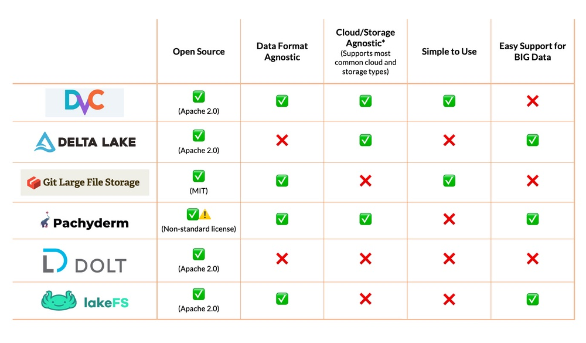

# Инструкция по работе с git

## Что это и для чего нужна система контроля версий?

### Что такое система контроля версий?

### Для чего нужна система контроля версий

## Установка git и VSCode на ваш ПК.

### Установка VSCode на ваш ПК.

### Установка git на ваш ПК

#### Первая настройка git

## Создание и базовая работа с локальным репозиторием.

### Что такое репозиторий и инструкция по созданию локальных репозиториев.

### Базовая работа с локальным репозиторием

## Ветки. Локальная работа с ветками в git.

### Что такое ветки и для чего они нужны при работе с системой контроля версий.

### Базовая работа с ветками в git.

## Работа с удаленными репозиториями.

### Что такое удаленный репозиторий и для чего он нужен

### Базовая работа с удаленными репозиториями GitHub

## Совместная работа над проектом (fork, pull request)

### Как строится и для чего нужна совместная работа в системах контроля версий

### Инструкция по созданию pull request

## Книги и полезные ссылки по изучению git.

## Альтернативные системы контроля версий.

### **1. DVC (Data Version Control):**

*DVC* - один из многих доступных инструментов с открытым исходным кодом, упрощающих работу с проектами Data Science и ML.

Используется подход Git'а в том смысле, что дает интерфейс командной строки, который настраивается в несколько простых шагов. DVC фокусируется не только на версионировании данных. Инструмент помогает командам управлять конвейерами и моделями машинного обучения.

#### **Преимущества:**

Лёгкий, исходники открыты, подходит для всех основных облачных платформ и типов хранилищ данных.
Гибкий, независимый от формата и фреймворка, лёгкий в применении.

#### **Недостатки:**

Тесно связан с управлением конвейером (если уже применяется другой инструмент конвейера данных, будет дублирование).
DVC лёгкий - возможно, придётся вручную разработать дополнительные функции.

### **2. Delta Lake:**

*Delta Lake* — слой хранилища с открытым исходным кодом, помогающий улучшить состояние озёр данных. Это делается предоставлением транзакций ACID, версионированием данных, управлением метаданными и управлением версиями данных. Инструмент находится ближе к слою абстракции озёр данных, заполняя пробелы там, где большинство озёр данных ограничены.

#### **Преимущества:**

Предлагает множество функций, которые могут не входить в вашу систему хранения данных, например ACID-транзакции или эффективное управление метаданными.
Снижает необходимость в ручном управлении версиями данных и ручном решении других связанных с данными вопросов, позволяя разработчикам сосредоточиться на построении продуктов поверх озёр данных.

#### **Недостатки:**

Delta Lake часто бывает перегибом для большинства проектов: инструмент был разработан для работы со Spark на больших данных.
Требуется специальный формат данных, а это означает, что инструмент теряет в гибкости и зависим в отношении текущих форматов.
Основная задача инструмента — действовать в качестве скорее уровня абстракции данных, а это может быть не тем, что нужно вашей команде, и также может игнорировать разработчиков, которым нужно решение легче.

### **3. Git LFS:**

*Git LFS* — разработанное рядом разработчиков расширение Git'а с открытым исходным кодом. Это ПО предназначено для устранения больших файлов, которые могут быть добавлены в ваше хранилище (например фотографий и наборов данных) с помощью указателей. Указатели легче, они указывают на хранилище LFS. Таким образом, когда вы отправляете изменения из вашего репозитория в основной, обновление не занимает много времени или места. Это очень легковесный вариант для управления данными.

#### **Преимущества:**

Легко интегрируется в рабочие процессы разработки большинства компаний.
Использует те же права доступа, что и репозиторий, поэтому нет необходимости в дополнительном управлении правами.

#### **Недостатки:**

Git LFS для хранения ваших данных требует выделенных серверов. Это, в свою очередь, в конечном счёте приводит к тому, что ваши группы дата-сайентистов оказываются заблокированными, а также к увеличению объема инженерной работы.
Серверы Git LFS не предназначены для масштабирования в отличие от DVC, который хранит данные в более общем и легко масштабируемом хранилище объектов, например S3.
Очень специфичен и может потребовать использования ряда других инструментов для иных этапов рабочего процесса в Data Science.

### 4. **Pachyderm:**

*Pachyderm* — одна из немногих платформ для сбора данных в этом списке. Цель Pachyderm — создать платформу, позволяющую легко воспроизводить результаты моделей ML, управляя всем рабочим процессом обработки данных. В этом отношении Pachyderm — Docker для данных.

Pachyderm использует контейнеры Docker для упаковки вашей среды выполнения. Это позволяет легко воспроизвести результат. Сочетание версионирования данных и Docker дает специалистам Data Science и командам DevOps легко развёртывать модели и обеспечивать их согласованность. Компания Pachyderm взяла на себя обязательства по Биллю о правах в Data Science, в котором изложены основные цели продукта: воспроизводимость, знание истории данных, сотрудничество, инкрементальность и автономия, а также абстрагирование инфраструктуры. Эти принципы определяют многие из особенностей продукта и позволяют командам воспользоваться преимуществами инструмента в полной мере.

#### **Преимущества:**

Базируется на контейнерах, что делает ваши среды данных портативными и лёгкими в миграции на различных вендоров облачных услуг.
Надёжный, масштабируется от небольших до очень больших систем.

#### **Недостатки:**

Кривая обучения круче из-за большого количества подвижных частей, таких как сервер Kubernetes, необходимый для управления бесплатной версией Pachyderm.
При наличии различных технических компонентов сложно будет интегрировать Pachyderm в уже существующую инфраструктуру.

### **5. Dolt:**

*Dolt* — уникальное решение для версионирования данных. В отличие от некоторых других представленных вариантов, которые просто содержат данные о версии, Dolt — это база данных SQL с версиями в стиле Git. Но в отличие от Git'а, где в центре файлы, у Dolt в центре  — таблицы. Это означает, что вы можете обновлять и изменять данные, не беспокоясь о потере изменений. Приложение ещё новое, в ближайшем будущем планируется сделать его на 100 % совместимым с Git и MySQL.

#### **Преимущества:**

Инструмент лёгкий, и его код частично открыт.
SQL-интерфейс делает его доступнее для аналитиков данных в сравнении с более непонятными вариантами.

#### **Недостатки:**

По сравнению с другими версиями баз данных Dolt — еще не зрелый продукт.
Dolt — это база данных, то есть вы должны перенести свои данные в Dolt, чтобы получить его преимущества.
Dolt создан для версионирования таблиц. Это означает, что он не охватывает другие типы данных (например изображения или текст в свободной форме).

### **6. LakeFS:**

*LakeFS* позволяет командам строить повторяющиеся, атомарные и версионированные операции с данными об озёрах. Предоставляется Git-подобная модель ветвления и управления версиями, предназначенная для работы с вашим озером данных, и она масштабируется до петабайт данных.

Подобно Delta Lake, LakeFS обеспечивает соответствие ACID в ваших озёрах данных. Однако LakeFS поддерживает как AWS S3, так и Google Cloud Storage в качестве бэкендов, а это означает, что для использования всех преимуществ не требуется использовать Spark.

#### **Преимущества:**

Предоставляет расширенные возможности, такие как ACID транзакции, для лёгкости использования облачного хранения данных (например S3 и GCS), и всё это вне зависимости от формата.
Легко масштабируется, поддерживая очень большие озёра данных. Способен предоставить контроль версий как для среды разработки, так и для производственной среды.

#### **Недостатки:**

LakeFS — относительно новый продукт, поэтому по сравнению с другими решениями функции и документация могут меняться быстрее.
Ориентирован на версионирование данных, а это означает, что вам потребуется использовать ряд иных инструментов для других этапов рабочего процесса Data Science.

### **7. Bazaar:**

*Bazaar* - система контроля версий, которая помогает отслеживать историю разработки и упрощает сотрудничество с другими разработчиками, которые могут быть одним разработчиком, совместной командой или сообществом разработчиков по всему миру. Он масштабируется и адаптируется в соответствии с вашими потребностями. Это бесплатное, с открытым исходным кодом и распространяемое программное обеспечение для управления версиями, которое обеспечивает удобный интерфейс, спонсируется Canonical и очень похоже на Git и Mercurial. Это самая универсальная система управления версиями, которая поддерживает различные формы рабочего процесса, от централизованного до децентрализованного, позволяет вам работать с центральным сервером или без него с множеством различных вариантов, признанных повсюду.

#### **Преимущества:**

Мощный и кроссплатформенный. Высокая скорость и эффективное использование хранилища. Отслеживание переименований и интеллектуальное объединение. Его система плагинов довольно проста в использовании.

#### **Недостатки:**

Не поддерживает частичную проверку и клонирование. Не обеспечивает сохранение временных меток.

### **8. Apache Subversion (SVN):** 

*SVN* - это бесплатное программное обеспечение с открытым исходным кодом, наиболее подходящее для широко используемого инструмента CVS, и было создано как альтернатива CVS после исправления ошибок и недостатков системы CVS при сохранении высокой совместимости с ней, и именно поэтому многие разработчики перешли на SVN для лучших и улучшенных функций CVS.

SVN использует концепцию атомарных операций для предотвращения повреждения базы данных, что было основным недостатком CVS. При атомарной работе применяются все или ни одно из изменений, внесенных в исходный код, чтобы никакие частичные изменения не нарушали исходный код. В то время как операции ветвления CVS стоят дорого, операции ветвления SVN дешевы и не зависят от размера файла, что делает его более удобным для больших разветвленных проектов со многими направлениями.

#### **Преимущества:**

Поддерживает атомарные операции для предотвращения коррупции.
Метаданные с версиями в свободной форме. Поддерживает пустые каталоги и более дешевые операции с ветками. Имеет лучшую поддержку Windows по сравнению с Git. Широкий выбор плагинов для ведущих IDE и гибких инструментов.

#### **Недостатки:**

Недостаточно команд управления репозиторием и нет поддержки подписанных версий. Гораздо более низкая скорость по сравнению с git. Содержит ошибки, связанные с нормализацией имен файлов и каталогов

### **9. Mercurial:**

*Mercurial* - это бесплатный инструмент управления версиями с открытым исходным кодом и распределенным исходным кодом, который эффективно обрабатывает проекты любого размера и предлагает простой и интуитивно понятный интерфейс. Это основной конкурент git, написанный на языке программирования python и поддерживаемый в различных ОС, таких как Mac, Windows, Linux и т.д. Он хорошо известен своей высокой производительностью, надежностью и масштабируемостью. Он обладает интегрированным веб-интерфейсом и способен к расширенному ветвлению и объединению.

#### **Преимущества:**
Быстрый и мощный. Его легко освоить. Легкий и портативный.
Намного проще, чем другие сложные VCS.

#### **Недостатки:**

Нет частичных проверок. Поддерживает только дополнения, написанные на Python, следовательно, довольно проблематично с дополнительными расширениями.

### **Ссылки:**

1. [Habr](https://habr.com/ru/company/skillfactory/blog/527510// "Хабр, контроль версий на 2020 год")
2. [Geeksforgeeks](https://www.geeksforgeeks.org/top-5-free-and-open-source-version-control-tools-in-2020/ "Тоже контроль за 2020 год, возможен корявый перевод")